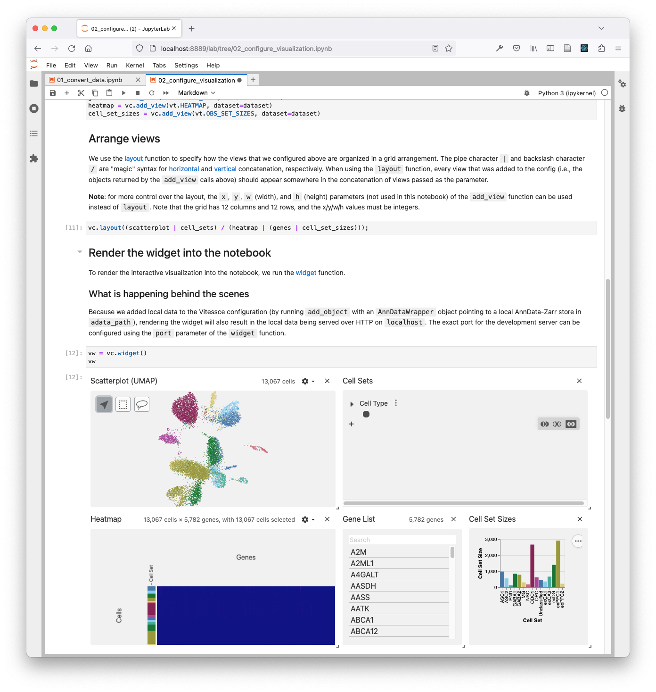
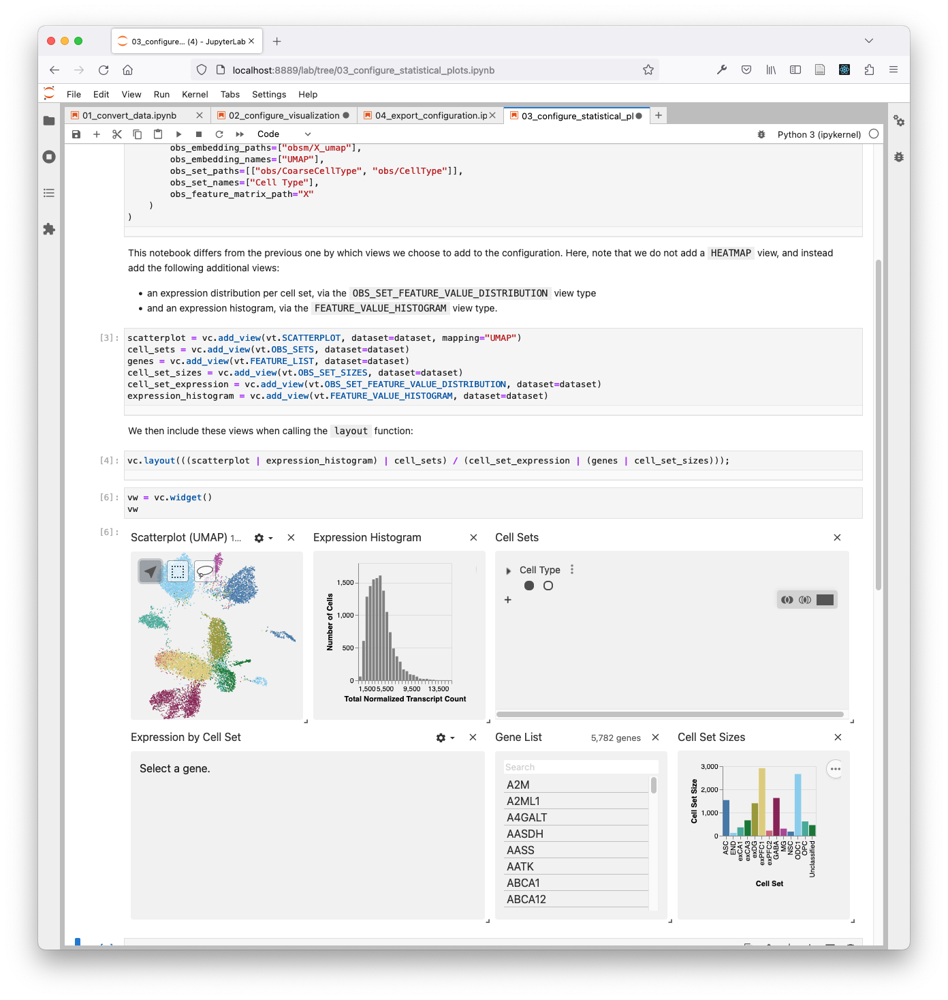
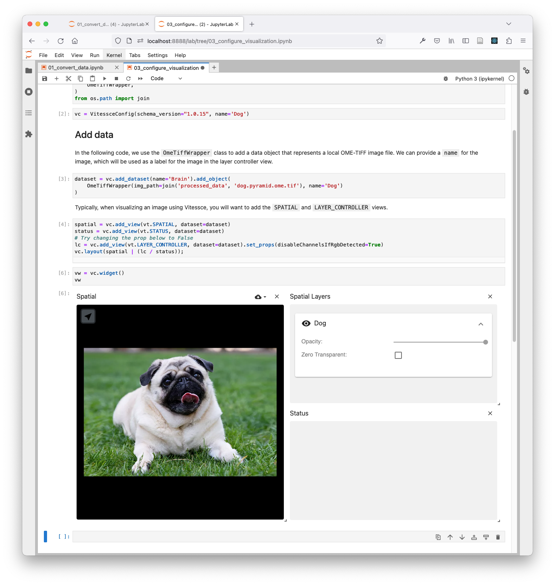
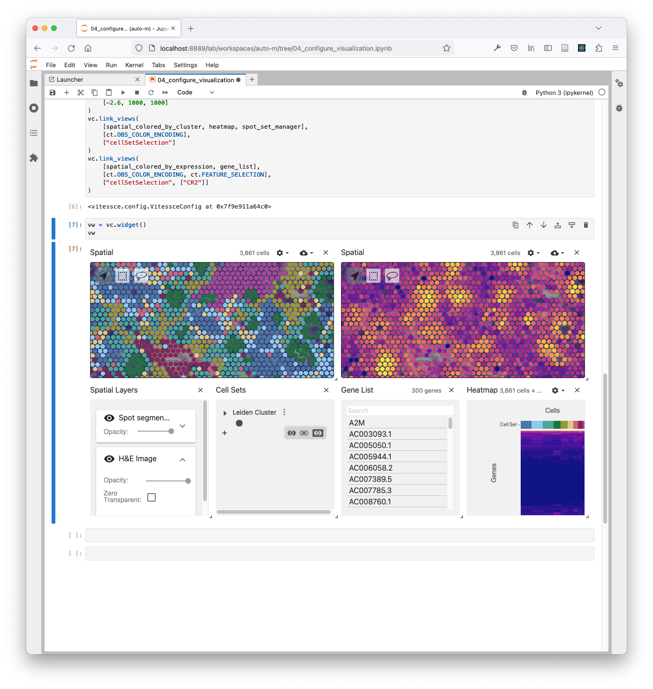

# vitessce-python-tutorial

This tutorial will teach you how to use the `vitessce` python package to construct Vitessce configurations for local datasets.

<div style="display: flex; flex-direction: column;">




</div>

### Examples

The example notebooks in `examples/` demonstrate the types of visualizations that are possible to create with Vitessce. These contain minimal examples of each data type, and they point to remote data so that they can be executed in cloud notebook environments such as Google Colab.

### Tutorials

The tutorial notebooks in `tutorials/` demonstrate required data processing and conversion steps, visualization configuration, and data/configuration exporting.

### Templates

The template notebooks in `templates/` contain fill-in-the-blank comments for adapting them to your own data. They contain fewer explanations and descriptions than the tutorial notebooks, and the three steps of data processing, visualization configuration, and exporting are merged rather than split across different notebooks.

## Setup

Prerequisites:
- [conda](https://conda.io/projects/conda/en/latest/user-guide/install/index.html) installation
- familiarity with Python code and Jupyter notebooks
- familiarity with using the command line (e.g., installing command line tools, downloading files)

Set up the Python environment using conda:

```sh
conda env create -f environment.yml
```

### Image data processing (optional)

To convert image data into OME-TIFF format, you will want to install [`bftools`](https://docs.openmicroscopy.org/bio-formats/latest/users/comlinetools/index.html) by unzipping it. My installation is located at `~/software/bftools`.


## Run notebooks

Activate the environment:

```sh
conda activate vitessce-tutorial-env
```

Launch JupyterLab in the sub-directory of interest:

```sh
jupyter lab --notebook-dir=./tutorials/transcriptomics
# or
jupyter lab --notebook-dir=./tutorials/imaging
# or
jupyter lab --notebook-dir=./tutorials/spatial_single_cell
# or
jupyter lab --notebook-dir=./templates
```

To download the raw data for the tutorials, run the following notebooks:

- `./tutorials/transcriptomics/raw_data/download.ipynb`
- `./tutorials/spatial_single_cell/raw_data/download.ipynb`

## Additional resources

- [Vitessce demo data processing scripts](https://github.com/vitessce/vitessce-python/tree/main/demos)

## References

Raw data:
- Transcriptomics data from https://www.covid19cellatlas.org/index.healthy.html#habib17
- Visium data from https://scanpy.readthedocs.io/en/stable/generated/scanpy.datasets.visium_sge.html#scanpy.datasets.visium_sge
